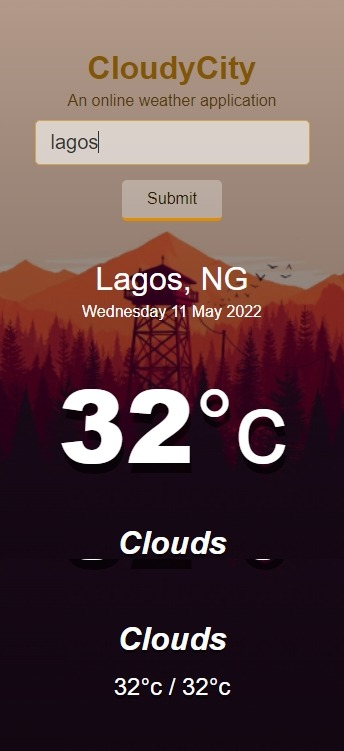

# Cloudycity
A SPA weather application for checking current wether information of a given city.
This project was created using HTML CSS JAVASCRIPT and a weather API [Openweathermap](https://openweathermap.org/)

Live demo [_Here_](https://cloudycity-bdc8f.web.app/)

 

 >

## Features
- Users can create, edit, and remove campgrounds
- Users can review campgrounds once, and edit or remove their review
- User profiles include more information on the user (full name, email, phone, join date), their campgrounds, and the option to edit their profile or delete their account
- Search campground by name or location
- Sort campgrounds by highest rating, most reviewed, lowest price, or highest price
- Run it locally